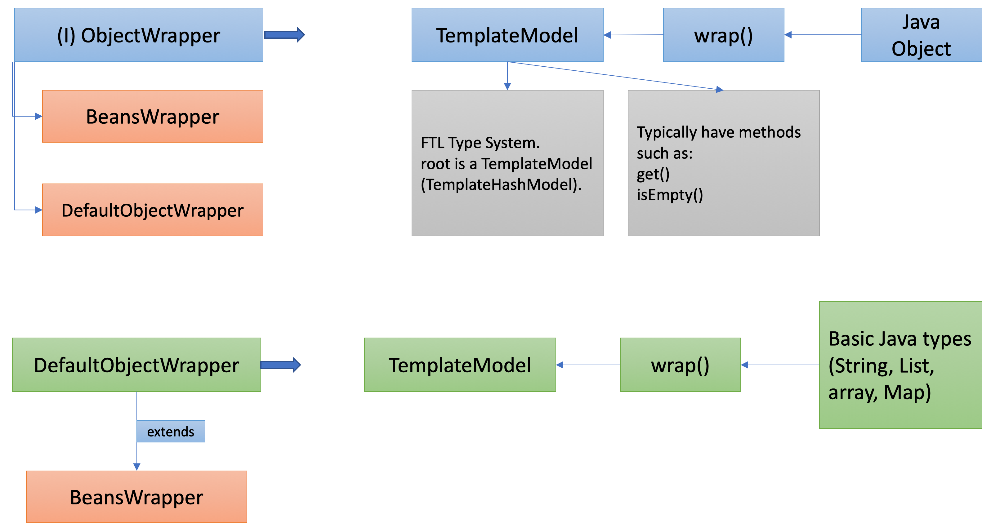

# FreeMarkerForVelocity
* Try out Apache Velocity and FreeMarker
* Try if FreeMarker is able to replace Apache Velocity

&nbsp;

### Some Learning Notes ###
##### What is Apache Velocity #####
* "If you're new to Velocity, you can read the Overview to understand its principles.  
Then, you can go through the User Guide for more details. 
* You can check the Velocity Template Language (VTL) reference to write templates,   
and the Developer Guide to guide you in the process of configuring and integrating Velocity. "
&nbsp;

* Velocity is a Java-based **templating engine**. 
* A template engine is a Java **library** to generate text output (HTML web pages, e-mails, configuration files, source code, etc.)
 based on templates and changing data.
&nbsp;

##### Velocity Singleton Model #####
* there is only one instance of the Velocity engine in the JVM that is shared by all.
* This is very convenient as it allows **localized configuration** and **sharing of resources**, e.g. templates, a logger, properties etc. 
* Velocity.init();
&nbsp;

##### Velocity Separate Instance #####
* separate instance allows you to create, configure and use as many instances of Velocity as you wish in the same JVM. 
* This is useful when you wish to support separate configurations, such as template directories, loggers, etc in the same application.
* VelocityEngine ve = new VelocityEngine(); ve.init();
&nbsp;

##### Important #####
* The Singleton we talking about here is the **Velocity engine instance**. 
&nbsp;   
&nbsp;   

##### FreeMarker Concepts #####
* Interface `ObjectWrapper`: has a method **`wrap()`** that **converts** Java objects to `TemplateModel`. 
* Some implementations of `ObjectWrapper` interface: `BeansWrapper`, `DefaultObjectWrapper`. 
* A `TemplateModel` is FTL's type system. 
* A `TemplateModel` typically has methods like `get()`, `isEmpty()`.
* The data-model itself (the root variable) is a TemplateModel (TemplateHashModel). 
* `DefaultObjectWrapper` **wraps** basic Java types (String, List, array, Map) into `TemplateModel`.
* `DefaultObjectWrapper` is set as `Configurations`'s default ObjectWrapper. 
* `BeansWrapper`is used instead of `DefaultObjectWrapper` only when: 
  1. The Collection-s and Map-s of the model should be allowed to be modified during template execution.
  2. If the identity of the array, Collection and Map objects must be kept when they are passed to a wrapped object's method in the template. 
  3. If the Java API of the earlier **listed classes (String, Map, List** ...etc) should be visible for the templates.  
* `DefaultObjectWrapper` extends `BeansWrapper`.  
* Using BeansWrapper directly is not recommended anymore. Use its subclass, DefaultObjectWrapper instead. 

&nbsp;

#### FreeMarker: Ways to pass in Static methods to templates ####
The issue is: Passing in `StringUtils.class` and using static `StringUtils.trimmedSplit()` in template will result in: `StringUtils.trimmedSplit evaluated to null or missing`
##### 1:  Use TemplateMethodModelEx #####
* Make trimmedSplit method into a class and implement [TemplateMethodModelEx](https://freemarker.apache.org/docs/pgui_datamodel_method.html).
* Pass in an instance of the method object into template.
* Diff between `SimpleScalar.getAsString()` vs `SimpleScalar.toString()`: 
  * `SimpleScalar.getAsString()`: `return this.value == null ? "" : this.value;`
  * `SimpleScalar.toString()`: `return this.value;`
&nbsp;
##### 2: Pass in an initialised StringUtils instance (Bad Practice) #####
* Pass in `new StringUtils()` to template 
* Question: Will this work for Utility Classes?  
Depends.   
For a completely stateless utility class in Java, the is declared public and final,   
and it has a private constructor to prevent instantiation.   
Another example: org.apache.commons.lang3.StringUtils: StringUtils instances should NOT be constructed in standard programming.
* Therefore, Way 2 should not be used in general.
* Also, even if it is a non utility class (in the case of this StringUtils), it may be bad or costly to instantiate an instance.     
&nbsp;
##### 3: Use TemplateHashModel #####
* The `TemplateHashModel` returned from `BeansWrapper.getStaticModels()` can be used to create hash models for accessing static methods and fields of an arbitrary class.
* `TemplateHashModel stringUtilsStatics = (TemplateHashModel) staticModels.get("me.liheng.codeGenerator.StringUtils");`
&nbsp;
##### 4: statics [class] #####
* In java file: `root.put("statics", statics);`
* In ftl file: `<#assign StringUtils = statics['me.liheng.codeGenerator.StringUtils'] >`
&nbsp;

##### Question: If I have several utility classes to pass into ftl, which of 3 or 4 is better? #####
* Way 3
* Way 4 passes in the whole statistics. 
* Way 4 has even **more security implications**, as someone could even invoke `System.exit()` using this model if the method exposure level is weakened to `EXPOSE_ALL`.
&nbsp;  
&nbsp;

### Important: 2 ways to invoke Java API of List ###
1. `BeansWrapper.getDefaultInstance().wrap();` ([Reference](https://freemarker.apache.org/docs/pgui_misc_beanwrapper.html))
2. `value?api.someJavaMethod()` ([Reference](https://freemarker.apache.org/docs/versions_2_3_22.html))
##### value?api.someJavaMethod() #####
* Need to setAPIBuiltinEnabled to true. 
* Yes, the original object will be modified. (Eg, remove() can modify)
&nbsp;  
&nbsp;  

##### usCavalry #####
Unable to: 
1. Cannot identify color #
2. Cannot parse to use built-in's
3. foreach cannot parse to list  
4. parse calling of macro 

Able to:
1. Parse if else quite well 
2. comments parsed well
3. set parse to assign
4. remove the $ sign well
5. parse macro file
&nbsp;

&nbsp;
----
### Useful links ###
* [Javaguides Apache Velocity Tutorial](javaguides.net/2019/11/apache-velocity-tutorial.html)
* [Apache Velocity User Guide](https://velocity.apache.org/engine/2.0/user-guide.html)
* [Apache Velocity Developer Guide](https://velocity.apache.org/engine/1.7/developer-guide.html)
* [Baeldung Introduction to Apache Velocity](https://www.baeldung.com/apache-velocity)
* [FreeMarker Manual](https://freemarker.apache.org/docs/index.html)
* [The official extension of FreeMarker template files](https://freemarker.apache.org/docs/versions_2_1_3.html)
* [javatpoint: JavaMail Tutorial](https://www.javatpoint.com/java-mail-api-tutorial)
* [Google SMTP Server – How to Send Emails for Free](https://www.siteground.com/kb/google_free_smtp_server/)
* [tutorialspoint: Java - Sending Email](https://www.tutorialspoint.com/java/java_sending_email.htm)
* [Java Properties](https://docs.oracle.com/javase/tutorial/essential/environment/properties.html)

* [usCavalry: Migrating from Velocity](https://freemarker.sourceforge.io/usCavalry.html)